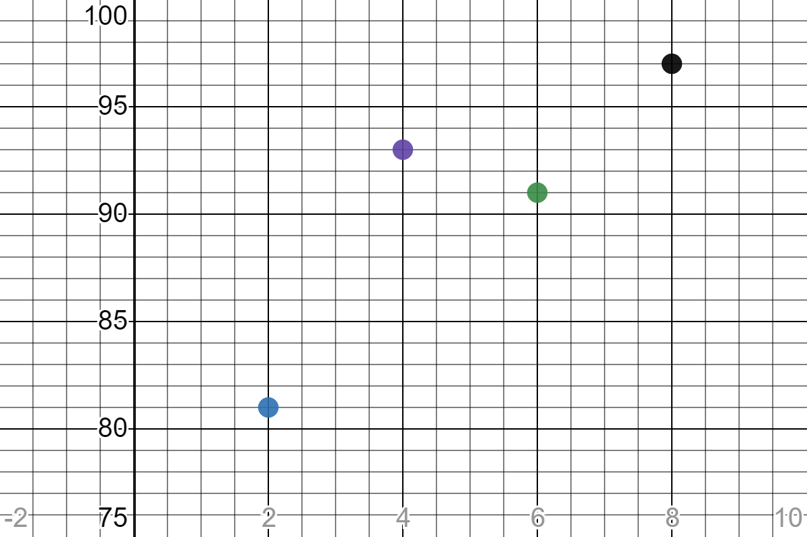
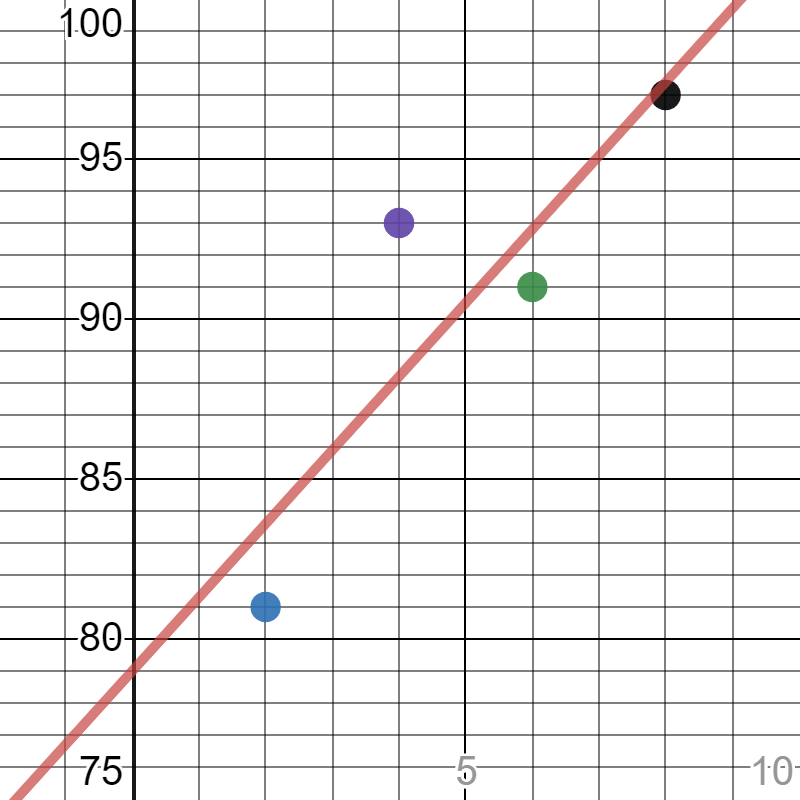
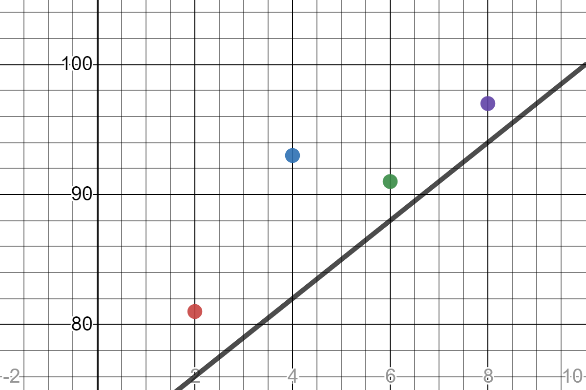
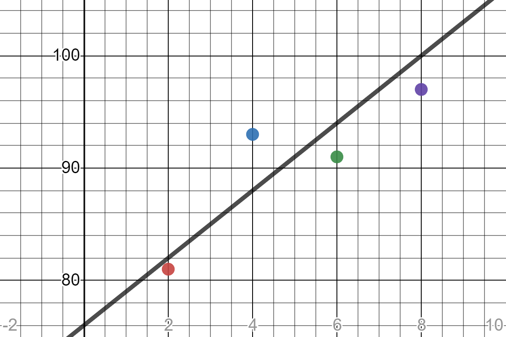
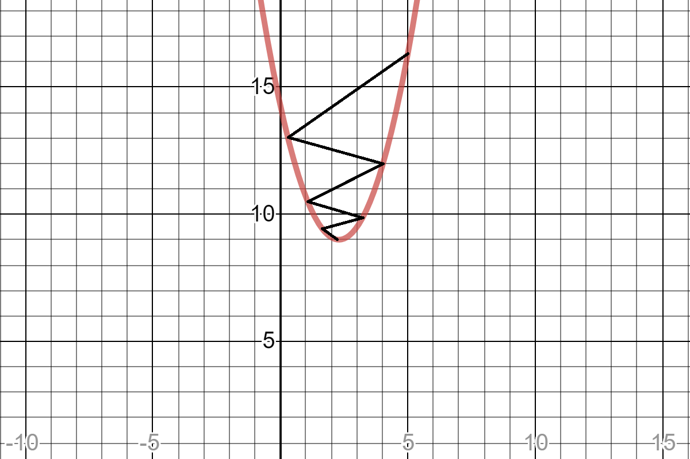

# intro

딥러닝에 대해서 공부해보기 전에
데이터를 가장 쉽게 분석할 수 있는 방법부터 생각해볼 필요가 있음

선형 회귀 (linear regression) 라고 하는 방법
네이버에는 
https://terms.naver.com/entry.nhn?docId=827565&cid=42344&categoryId=42344
이렇게 다루고 있지만...
도저히 어떤 내용인지 알아먹기가 어렵다.

딥러닝에 대해서 다루기 전에 먼저 선형회귀부터 이해하고 시작하게 되면
우리가 왜 이것을 배워야 하는지 알 수 있을 것 같아서.. 먼저 시작해봄

# example1

만약 학생들의 '중간고사 성적'과 각 학생이 '공부한 시간'에 대한 데이터가 있다고 생각해보자

|공부한시간|2시간|4시간|6시간|8시간|
|------|---|---|---|---|
|성적|81점|93점|91점|97점|

공부한 시간을 X라고 하고, 성적을 y라고 할 때
X와 y에 대한 집합을 아래와 같이 표현해볼 수 있다.

그래프로 그려보면 이렇다. (그리기 참 어렵다. https://www.desmos.com/calculator)

만약에 위 데이터를 분석해보면서
100점을 맞을려면 몇시간을 공부해야 하는지 추론해보려면 어떻게 해야할까?

위 점들에 대한 추세가 잘 나타나도록 직선 그래프를 하나 딱! 그리고 y가 100일 때 x를 구하면 되지 않을까?

여기서 그 직선 그래프는 아래와 같이 표현될 수 있는데

우리가 수학시간에 배웠던 1차함수 그래프!!
a는 기울기!! b는 y절편!! 으로 배웠을 것이다.

자 이제 그릴 준비는 다 되었는데..
어떻게 그려야 잘그렸다고 소문이 날까?

이 직선을 잘 그으려면 2가지 값만 잘 예측하면 된다.
a,b

딥러닝의 시작점은 이 a,b 값을 잘 예측하는 것으로 부터 시작된다고 봐도 과언이 아니다.

이제 선을 잘 긋는 방법부터 살펴보자

# 최소 제곱법

[https://ko.wikipedia.org/wiki/%EC%B5%9C%EC%86%8C%EC%A0%9C%EA%B3%B1%EB%B2%95](https://ko.wikipedia.org/wiki/최소제곱법)

먼저 시도해 볼 수 있는 방법은 최소 제곱법이라는 방법이다.

그래프와 각 점들과의 거리를 계산하여 가장 작게 나오도록 구한다. 라는 원칙을 기준으로

*** = 각 점들과 그래프와의 차이

요런 식을 만들고, 
고등학교 때 배운 '페르마의 정리'에 의해 
위 식의 미분값이 0이 나오게 되면
그때의 a,b값이 가장 정확한 그래프가 아닐까?

요 식이 최소가 된다고 한다면

a,b에 대한 각각의 편미분을 아래와 같이 해볼 수 있을 것이고

이렇게 두가지 수식으로 나눠볼 수 있다.

편미분 지금 풀려면 어려우니까 다풀고 난 수식만 적어보자면

최종적으로

위의 두 식이 남게 된다.

그럼 한번 대입해서 계산해볼까? 개수가 4개니 n은 4이고...

위 연립방정식을 풀게되면

가 나오게 되어 아래의 직선의 방정식을 구하게 된다.

한번 그래프를 그려볼까?

대충 잘 맞아 들어가는 것을 볼 수 있다. 헤헷

100점 맞으려면 9시간 공부하면 되는군!!!

하지만!! 최소제곱법은 여러개의 입력값(x가 여러개...)이 있는 경우에는 이 공식만으로 처리할 수 없다 ㅠ

그래서 평균 제곱근 오차(root mean square error, RMSE)가 쓰이게 된다!!

# 평균 제곱근 오차

[https://ko.wikipedia.org/wiki/%ED%8F%89%EA%B7%A0_%EC%A0%9C%EA%B3%B1%EA%B7%BC_%ED%8E%B8%EC%B0%A8](https://ko.wikipedia.org/wiki/평균_제곱근_편차)

여러개의 입력이 있을때 어떻게 그래프를 그릴 수 있을까?

1. 임의의 선을 한번 그려본다.
2. 이 선이 얼마나 잘 그려졌는지를 평가한다(평균 제곱근 오차를 구한다.)
3. 2번의 오차를 바탕으로 그래프를 조금씩 수정해나간다.

이러한 방식으로 일반적인 선형회귀방식을 사용하게 된다.

그러면 한번 아무 선이나 먼저 그어보자.

정말 잘못그렸다.. 이렇게 그려서 추정했다가는 공부를 1시간이나 더하게 될것이다...

자 이때, 잘못 그은 선을 어떻게 바로잡을 수 있을까?
입력데이터에 나와 있는 y의 실제값(실제 학생들 점수)와 x(공부시간)을 y=3x+70 식에 대입해서 나오는 '예측값'과의 차이를 통해서 오차를 구해볼 수 있을것이다.

예를들어 2시간 공부했을대의 실제 나온 점수는 81점인데, 이 잘못그린 그래프에서는 76점으로 
오차가 -5정도 나는 것을 볼 수 있다.

이때 오차가 +값으로 나올 수도 있고, -값으로 나올 수도 있다.
그래서 어떻게 하는가? 각 오차에 제곱을 취했다가 평균을 구한뒤 다시 제곱근을 씌워준다.
(이것이 **평균제곱근오차!!(RMSE)**)

그러면 오차의 평균을 제대로 구할 수 있을 것이다.

p_i -> 실제값

넣어서 계산을 한번 해보면

6.403124.... 정도가 나오고

이값을 줄이기 위해 a,b값을 적절히 맞춰주어 더 적은 오차가 나오도록 수정한다.
예를들어, 쉽게 생각해서 b값인 70을 76으로 변경하면 

어랏, 좀 더 잘 맞을 것 같은 그래프가 나온다.

오차를 계산해보면

3.316624... 정도로 줄어드는 것을 볼 수 있다.

이러한 식으로 a,b 값을 조금씩 수정해가며 오차가 최소로 되도록 수정해 가다보면
언젠가 오차가 0에 가까워지는 값이 얻어질텐데 그때가 가장 제일 예측이 잘된 그래프라고 볼 수 있을 것이다.

# 경사하강법

이렇게 수동으로 그래프를 찾아나갈 수 없다..
게다가 코딩으로 짤려고 해도.. 어떻게 해야할지 전략이 필요하다...

그래서 나온 것이 경사 하강법(Gradient Descent, GD)이라고 하는 방법이다.
[https://ko.wikipedia.org/wiki/%EA%B2%BD%EC%82%AC_%ED%95%98%EA%B0%95%EB%B2%95](https://ko.wikipedia.org/wiki/경사_하강법)

예를들어, a,b값 중에 먼저 적절한 a값을 먼저 찾는다고 생각해보자.

생각해보면 
a값이 
2.3보다 적을때는 오차가 커지다가 
2.3이 되었을때 오차가 0이되고
다시 2.3보다 커지면 오차가 커지게 될것이다.

이를 그래프로 그려보면 (y = 오차라고 한다면)

그래프처럼 되지 않을까? 마치 아래처럼..

우리가 원하는 값은 오차가 최소가 되는 지점. 바로 x값이 2.3되는 지점이다.
고등학교 수학시간에 이런말을 들었을 것이다.
2차 그래프의 미분값이 0이되는 지점이 최소값 혹은 최대값을 나타내게 될텐데
이때는 최소값이 겠지?

이 최소값을 저 검은색 선처럼 점점 찾아나가는 방법을 경사하강법이라고 하며

아래의 과정으로 이뤄진다.

1. 처음 a1에서 미분을 구한다.
2. 구해진 기울기의 반대 방향 얼마간 이동시킨 a2에서 미분을 구한다.
3. a3에서 미분을 구한다.
4. 3에서의 값이 0이 아니면 a2에서 2~3번과정을 반복한다.

결국 미분의 값이 0이 될때까지 지그재그로 값을 찾아나가는 방법이라고 볼 수 있다.

여기서 우리가 계속해서 변경해갈 x값을 W(weight)라고 지정하고,
우리가 원하는 조건식(Cost function)을 구해보자면 아래와 같을 것이다.

그리고 위 과정의 2~3번 과정을 아래와 같이 표현해볼 수 있다.

위 식을 계속해서 반복하다보면 결국 W는 우리가 원하는 최적값 (2.3)에 수렴하게 될 것이다.

위 식에서 처음보는 alpha는 learning rate로 지그재그로 찾아나가는데 있어서 빠르게 찾아나갈지, 정확하게 찾아나갈지 설정해주는 값이라고 보면된다.

learning rate가 크면 클수록
(장점) 값이 빨리 바뀌고, 빠르게 수렴이 되지만
(단점) W를 변화시킬때 적절한 거리를 찾지 못해 발산하게 되어 영원히 값을 못찾을 수 있다.

learning rate가 작으면 작을수록
(장점) 수렴가능성이 커진다. 안정적이다. 
(단점) 속도가 느려서 한참 걸린다.

일단 이것이 기본적인 머신러닝, 딥러닝에서 쓰이는 것중에서 제일 기본적인 방식의 학습방법이라보면 된다.

이후에는 실질적으로 딥러닝의 기본 모델이 뉴럴네트워크에서
이 경사 하강법을 이용하여 어떻게 학습을 하고 판단을 내리게 되는지
간단한 로지스틱 회귀를 통해서 알아보도록 하겠다.

빠염~! 